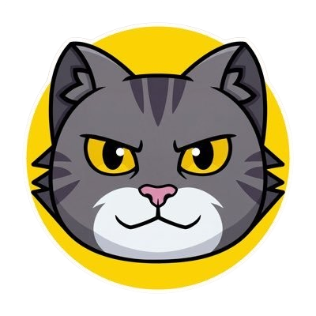

  

  # Catcoin PFP Generator

  **The ultimate community tool for customizing your Catcoin identity.**
  
  
  
  

---

## 🐱 About The Project

This **Catcoin PFP Generator** was built to empower the Catcoin community (`$catcoin`) to create unique, personalized avatars. Whether you want to rock a gold chain, sport some laser eyes, or vibe with a neon border, this tool puts the creativity in your hands.

It serves as a fun way to spread brand awareness, show solidarity on social media, and just have a good time with the meme.

**Key Features:**
*   **Infinite Combinations:** Mix and match shirts, hats, glasses, chains, and backgrounds.
*   **Custom Borders:** Add flair with neon, ridge, and inset borders in various colors.
*   **Interactive Preview:** See changes in real-time with a slick UI.
*   **One-Click Download:** Export high-quality images ready for Twitter, Telegram, or Discord.

## 🔗 Official Links

Stay connected with the Catcoin ecosystem:

*   **Website:** [catcoin.io](https://www.catcoin.io/)
*   **Contract:** `0xC0FE7F77ed2f522978b719372282ca89de8cF3e4`
*   **DexScreener:** [View Chart](https://dexscreener.com/ethereum/0xd7b5d68827f8a8859b135d3f86c76c43368ffed4)
*   **CoinMarketCap:** [Catcoin on CMC](https://coinmarketcap.com/currencies/catcoin-io/)
*   **CoinGecko:** [Catcoin on CG](https://www.coingecko.com/en/coins/catcoin-2)
*   **Etherscan:** [View Contract](https://etherscan.io/token/0xC0FE7F77ed2f522978b719372282ca89de8cF3e4)

## 👨‍💻 Created By

This project was developed with ❤️ by **jShiz**.

*   **Telegram:** [@jShiz](https://t.me/jShiz)

> "Building for the community, one pixel at a time."

## 🛠️ How to Context

This generator is a Next.js web application designed for speed and responsiveness. It layers assets dynamically using HTML5 Canvas for the final export, ensuring your PFP looks crisp regardless of the combination.

### Tech Stack
*   **Framework:** Next.js
*   **Styling:** Tailwind CSS
*   **Logic:** React Hooks & Local State
*   **Export:** Dynamic Canvas Rendering

---

  Catcoin is a community-driven project. This tool is a contribution to the HODLers.

